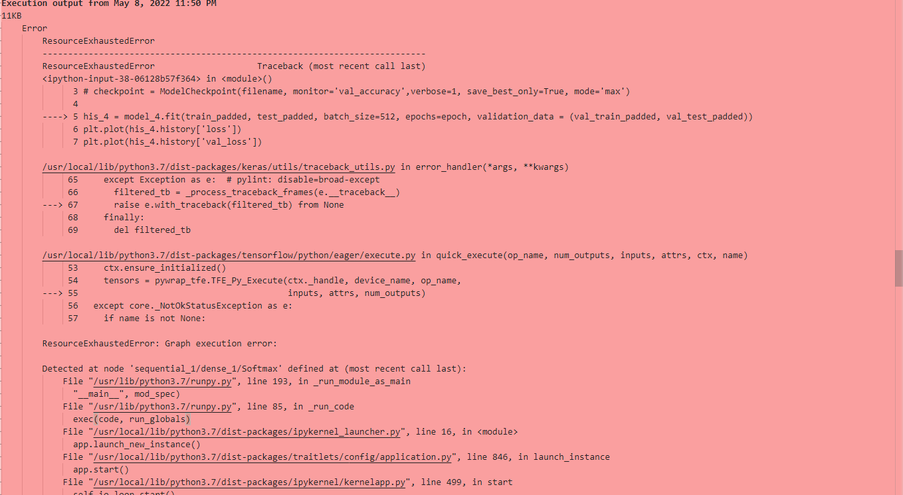
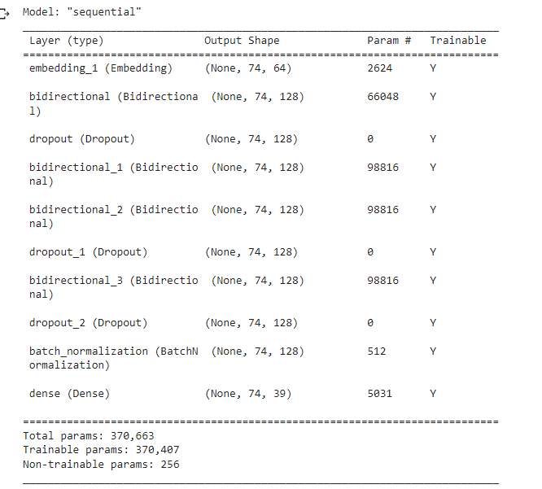
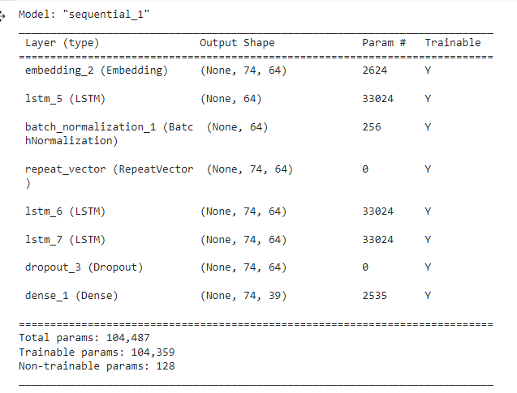
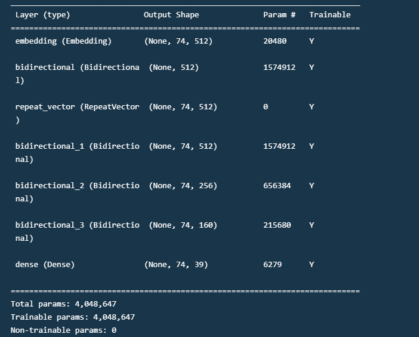
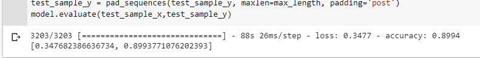

# CMPE255_SPRING22_FINAL_PROJECT

## Team Name - Team Globus

Group Members -

- Jack Zhu (JJLZ21)
- Virag Bhanderi
- Afroz Inamdar
- Alireza Mahin parvar
- Kanupriya Sanjay Agrawal

https://www.kaggle.com/datasets/samarthagarwal23/spelling-mistake-data-1mn

## Requirement and Version

Using device that has GPU memory is greater than 8GB for training
```
pipenv ==2022.1.8
tensorflow ==2.8.0
numpy ==1.21.6
Flask ==2.1.2
flask-ngrok ==0.0.25
```
## Instruction

```
pip install pipenv==2022.1.8
pipenv shell
pip install -r requirement.txt
python app.py
```

## Issue

### Model training

Always run out of GPU Memory due to RNN's Total params is huge


## Model

Using char level vocabulary for text correction.
40 vocabulary in grammared texts (a-z 0-9 ' )
39 vocabulary in corrected texts


Trying the first experiement model using Embedding and Bidrectional LSTM (Long Short Term Memory)


Next trying the second experiement model using Embedding with seq2seq (encoding layer and decoding layer)


Final model is combining both experiemnts above for better model developing


Final accuracy in traning: 0.9246
Final accuracy in validation: 0.8994



## Deployment of the Model using Flask

3 files required:
1. model.py 
2. app.py (server)
3. request.py

#### model.py:
Develop and train the model.

#### app.py:
Code to handle POST requests and return the results.
```
app = Flask(__name__)
model = pickle.load(open('model.pkl','rb'))

# For rendering results on HTML GUI
@app.route('/predict', methods=['POST'])
def predict():
    string_features = [x for x in request.form.values()]
    prediction = model.predict(string_features[0])
    return render_template('index.html', prediction_text='Correct sentence should be: {}'.format(prediction))
    
# For direct API calls trought request

@app.route('/results', methods=['POST'])
def results():
    data = request.get_json(force=True)
    prediction = model.predict([np.array(list(data.values()))])
    return jsonify(prediction)

```    

#### request.py:
Send requests with the features to the server and receive the results.
Used requests library to make post requests. requests.post() takes URL and the data to be passed in the POST 
request and the returned results from the servers are stored into the variable r and printed by r.json().

## Future work
Training the model with data and perform word level correction which will do the grammar correction.
The model is doing really well on the testing dataset due to insufficient vocabulary.

## Reference

"Towards better decoding and language model integration in sequence to sequence models" (Jan Chorowski, Navdeep Jaitly) https://arxiv.org/abs/1612.02695

"Bidirectional recurrent neural networks" (M. Schuster, K.K. Paliwal) https://ieeexplore.ieee.org/abstract/document/650093
